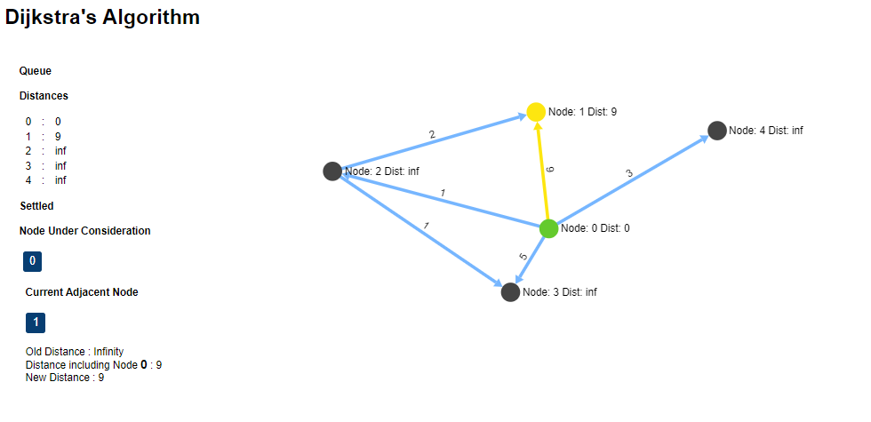
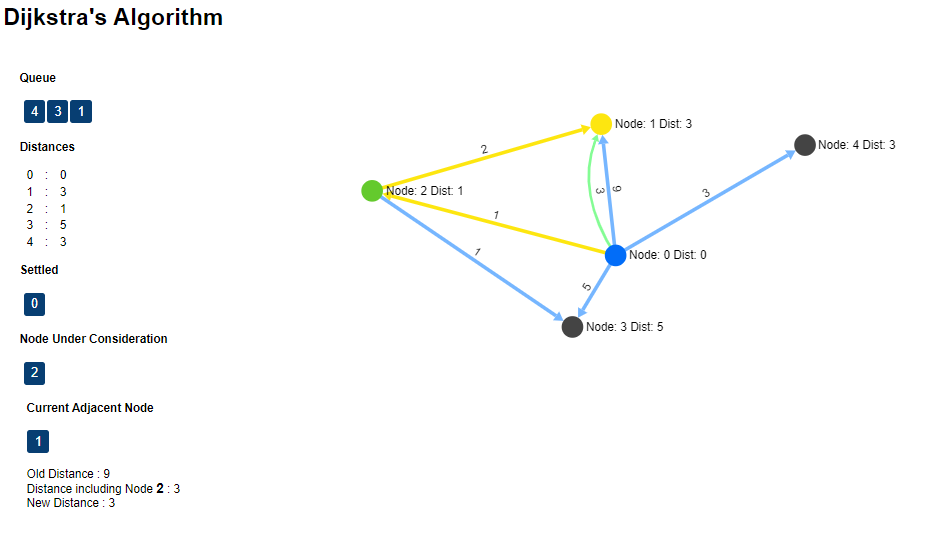
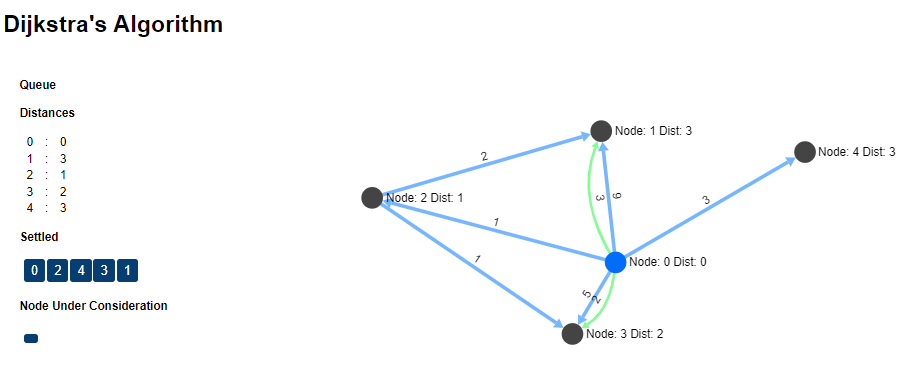
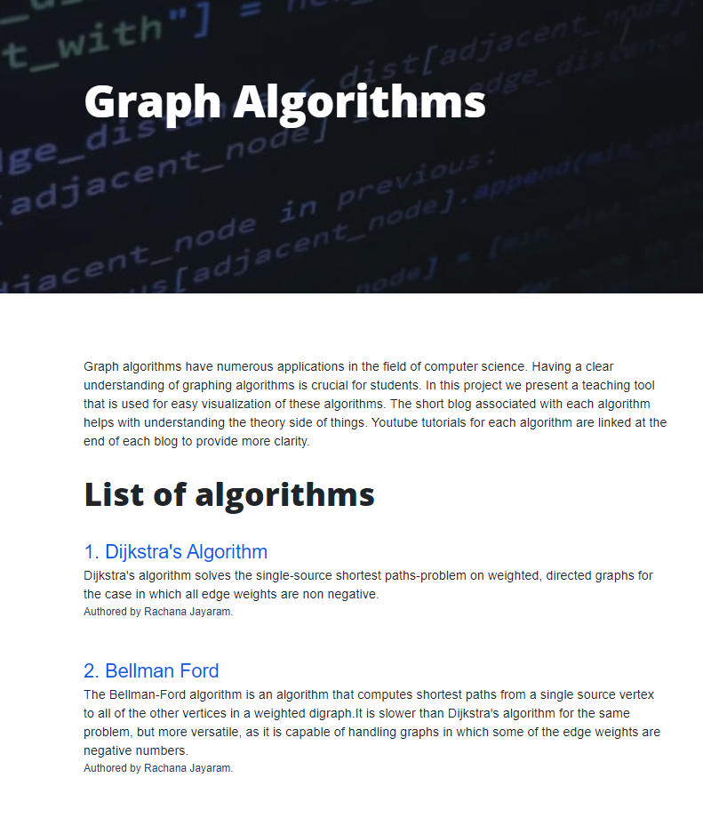
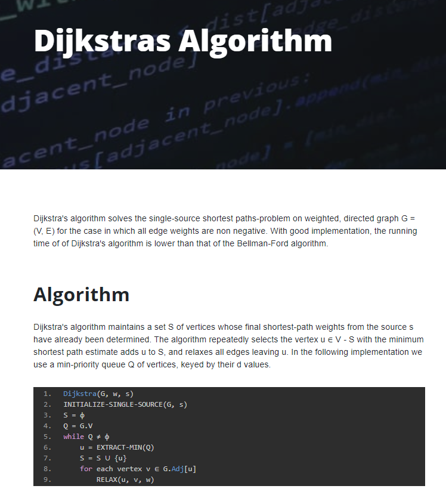
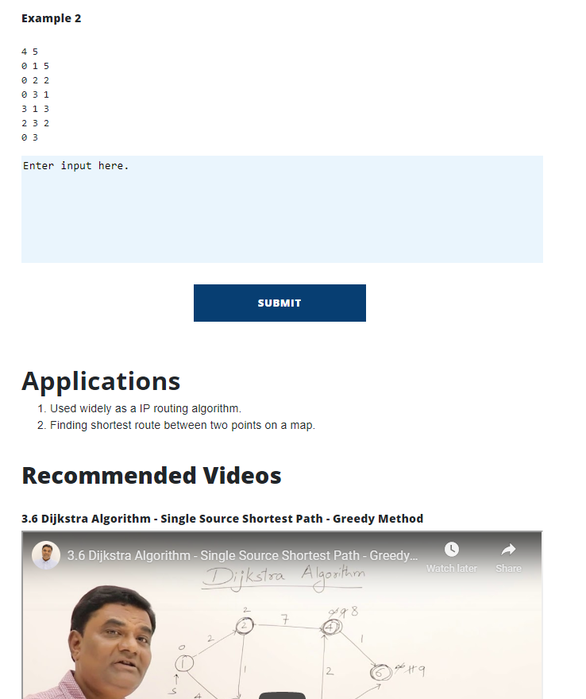
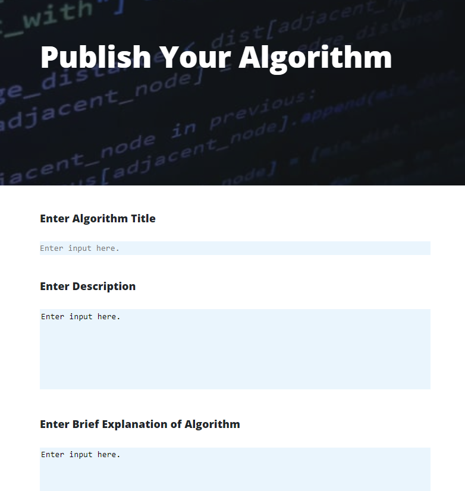
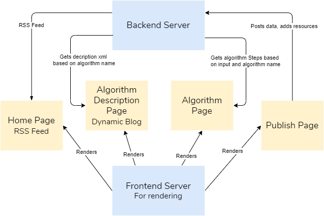

# Teaching Aid for Graph Algorithms

Graph algorithms have numerous applications in the field of computer science.
Having a clear understanding of graphing algorithms is crucial for students. 

In this project we present a teaching tool that is used for easy visualization of these algorithms. 

* The short blog associated with each algorithm helps with understanding the theory side of things. 
* Youtube tutorials for each algorithm are linked at the end of each blog to provide more clarity.
* Functionality to publish your own articles are provided.
* Visualization of Dijkstra's Algorithm.

## Frontend Frameworks
* Sigma JS
* AngularJS

## Backend Frameworks
* Flask

## Techniques Implemented
* RSS - Implemented an RSS feed for the blog 
* AJAX - Used ajax patterns to send and receive data from the server 
* RESTful API - Used rest principles for the API

## Intelligent Functionality
* Dynamic graph rendering algorithms
* Recommendation for youtube tutorials based on current article 

## Steps to run

Running Frontend Server
```
python rendering_server.py 
```

Running Backend Server
```
cd backend_server
python main_server.py
```

Running Unit Tests
```
pip install unittest
cd backend_server
python unit_test.py
```

Running System Tests
```
pip install selenium
cd backend_server
python system_test.py
```
## Screenshots
### Algorithm Steps 



<hr>


### Home Page

<hr>

### Description Page

<hr>


### Youtube Recommendations

<hr>


### Publishing Page

<hr>

### Flow Diagram

